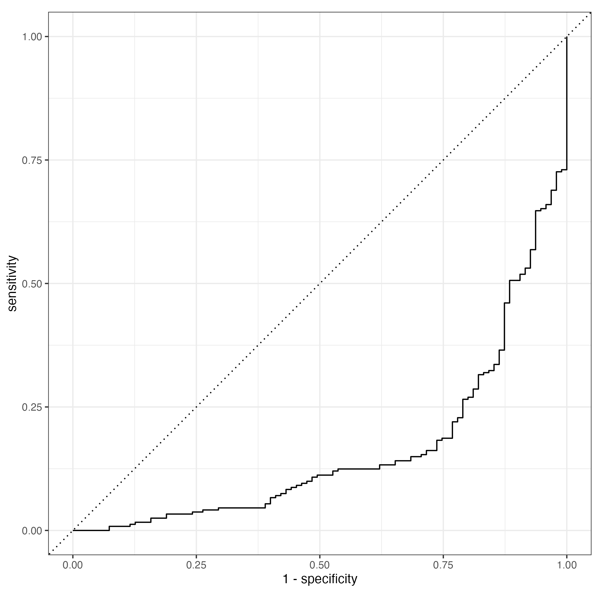

```{r setup, include=FALSE}
knitr::opts_chunk$set(echo = FALSE)
```
# Key Points:  
i.   major factors
ii. reliabilty   
iii. what needs to be done

# 1. Background   
Road safety is important for any society. It can enhance economic growth by ensuring the safe movements of resources, including human capital, across an economy. For this reason, the City of Toronto's Vision Zero Road Safety Plan is critical for the sustenance of its economy. Therefore, the goal of this project is to support this plan by investigating the factors that influence the probability that a pedestrian collision will result in serious injury or fatality.   

# 2. Modelling Methodology   
I extracted pedestrian collision data from the involved_persons data (maintained the data where involved_persons was equal to pedestrian). The outcome variable in this project is a binary variable, which equals 1 if the pedestrian collision resulted in major injury or fatality and 0 otherwise. Therefore, I used a classification algorithm (Random Forest) to model the probability that the outcome variable is equal to 1. The analysis was conducted with the R statistical programming language. To ensure the complete reproducibility of the results of this study, I employed the "Renv" package to document all the packages, including their metadata, I used in the project. Also, I used GitHub and Git to version control the project and to promote collaboration. More information on data wrangling, including dealing with missing and empty information, creating the final set of explanatory dummy variables, and duplicate rows, is provided in the file: exploration.pdf located in the root folder of this project. However, some of the major activities I conducted in this step are:   

1. serious injury or fatal pedestrian collisions account for about 11% of the information in the outcome variable. Estimating the model with such data could result in unreliable inference. I used the Synthetic Minority Oversampling Technique (SMOTE) to solve the imbalance problem. After the SMOTE analysis, the 11% statistic increased to about 24%.   
2. conducted hyper-parameter tuning on mtry and min_n Random Forest algorithm (RF) parameters; mtry is the number of variables randomly selected as candidates in each split, min_n is the minimum number of data points in each node required for it to be split further. This was to ensure that I get a best-fit RF.    
3. included latitude and longitude explanatory variables to account for location specific information in the model, they were normalized.

# 3. Findings

```{r , echo=FALSE, fig.cap="Variable Importance Plot", out.width = '80%', out.height= '50%'}
knitr::include_graphics("results/plots/variable_importance.png")
```

# 4. Model Accuracy
reated the outcome binary variables (serious_fatal) from the injured_persons data; it equals 1 if the pedestrian collision (involved_injury_class column) is fatal or major and 0 otherwise. Also, I created 10 binary variables from the 2 datasets (more information on data wrangling for this study is provided in the file: exploration.pdf located in the root folder of this project). We included latitude and longitude variables as explanatory variables to account for location specific information in the model, they were normalized. Serious injury or fatal pedestrian collisions account for about 11% of the information in the outcome variable. Estimating the model with such data could result in unreliable inference. I used the Synthetic Minority Oversampling Technique (SMOTE) to solve the imbalance problem. After the SMOTE analysis, the 11% statistic increased to about 31%. conducted hyper-parameter tuning on mtry and min_n Random Forest algorithm (RF) parameters
```{r , echo=FALSE, fig.cap="Receiver Operating Characteristic Curve", out.width = '80%', out.height= '50%'}

```

# 5. Future Work
Increasing the representation of under-represented class in the outcome variable is a second-best solution to solving an imbalanced dataset. The best solution will be to collect more data. 

# 6. Data Quality Issue
reated the outcome binary variables (serious_fatal) from the injured_persons data; it equals 1 if the pedestrian collision (involved_injury_class column) is fatal or major and 0 otherwise. Also, I created 10 binary variables from the 2 datasets (variable definitions are in Table 1 in the appendix). serious injury or fatal pedestrian collisions account for about 11% of the information in the outcome variable. Estimating the model with such data could result in unreliable inference. I used the Synthetic Minority Oversampling Technique (SMOTE) to solve the imbalance problem. After the SMOTE analysis, the 11% statistic increased to about 31%. conducted hyper-parameter tuning on mtry and min_n Random Forest algorithm (RF) parameters