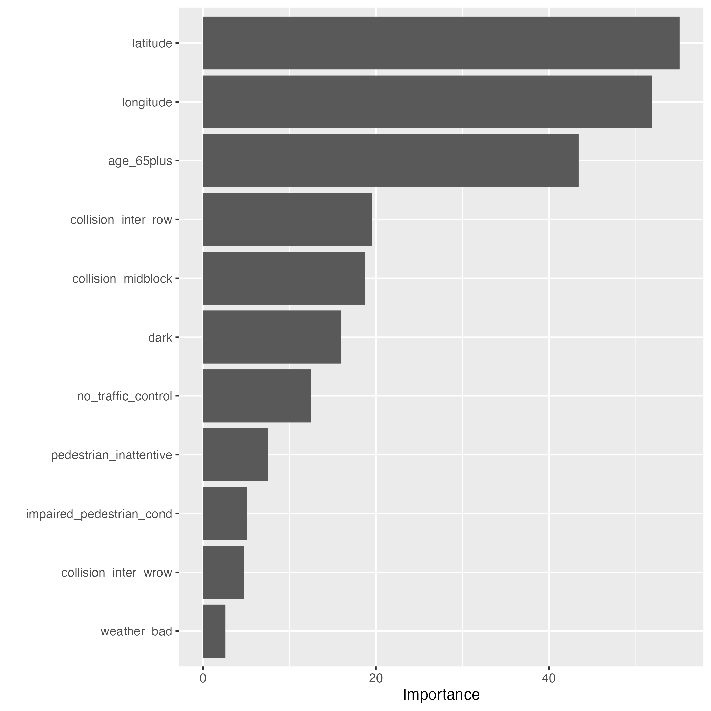

```{r setup, include=FALSE}
knitr::opts_chunk$set(echo = FALSE)
```
# Key Points:   

1. Location specific variables and age 65 or more are important drivers of the likelihood of fatality or major injury from pedestrian collision.
2. The model under-performed relative to chance, thus statistical inference from the model will be unreliably.
3. In the absence of reliable information, the qualitative insights from the model could be important in designing policies for road safety in the City of Toronto.
4. Further work such as data collecting more data and feature engineering, could potentially improve the model's predictive performance.

# 1. Background   
Road safety is crucial for any society. It can enhance economic growth by ensuring the safe movements of resources, including human capital, across an economy. In order to sustain its economy, the City of Toronto has implemented the Vision Zero Road Safety Plan. The goal of this project is to examine the factors that increase the likelihood of
pedestrian collisions resulting in serious injury or death, in support of the Vision Zero Road
Safety Plan.

# 2. Modelling Methodology   
I extracted pedestrian collision data from the involved_persons data (maintained the data where involved_persons was equal to pedestrian). The outcome variable in this project is a binary variable, indicating whether the pedestrian collision resulted in major injury or fatality (1) or not (0). Therefore, I used a classification algorithm (Random Forest) to model the probability that the outcome variable is equal to 1. The analysis was conducted with the R statistical programming language. To ensure the complete reproducibility of the results of this study, I employed the "Renv" package to document all the packages, including their metadata, I used in the project. Also, I used GitHub and Git to version control the project and to promote collaboration. Further information on data wrangling techniques, including dealing with missing and empty information, creating the final set of explanatory dummy variables, and duplicate rows, can be found in the file exploration.pdf located in the root folder of this project. However, some of the major activities I conducted in this step are:   

1. serious injury or fatal pedestrian collisions account for about 11% of the information in the outcome variable. Estimating the model with such data could result in unreliable inference. I used the Synthetic Minority Oversampling Technique (SMOTE) to solve the imbalance problem. After the SMOTE analysis, the 11% statistic increased to about 24%.
2. conducted hyper-parameter tuning on mtry and min_n Random Forest algorithm (RF) parameters; mtry is the number of variables randomly selected as candidates in each split, min_n is the minimum number of data points in each node required for it to be split further. This was to ensure that I get a best-fit RF.
3. included latitude and longitude explanatory variables to account for location specific information in the model, they were normalized.
4. Person's correlation matrix among the explanatory variables did not show any likely multicollinearity problem in the model.
5. I set aside 20% of the data as my test data (the remaining 80% was my training data) to be used in the last final model performance analysis. Further, I set aside 20% of the training data as my validation set to conduct model performance analysis immediately after the model estimation. The validation set and test data provided robust ways to generate performance metrics.
 
# 3. Findings
Latitude and longitude are the most important factors that drive likelihood of incidence of mortality or major injury from pedestrian collisions. These variables captured location attributes in the model. Therefore, it is not surprising that the four of the next five important variables are location specific (collision_inter_row, collision midblock, dark and no traffic control. Collision_inter_row is when vehicle went through or turned left or right at an interception and hit a pedestrian while walking without a row. All the model variables are defined in the exploration.pdf in the root folder. Also, the age (65 or more years) is an important variable in the model. The least important variable is bad weather. The variable importance plot is shown in Figure 1. 
```{r , echo=FALSE, fig.cap="Variable Importance Plot", out.width = '70%', out.height= '40%'}

```

# 4. Model Accuracy
Qualitatively, Figure 1 provides important insights into drivers of the likelihood of fatality or major injury from pedestrian collisions. In the absence of more robust statistical estimates, they could guide policy formulation toward road safety. Figure 2 (ROC curve) shows that the model under-performs relative to chance since the curve is significantly below the 45 degrees diagonal line. 

```{r , echo=FALSE, fig.cap="Receiver Operating Characteristic Curve", out.width = '70%', out.height= '40%'}
knitr::include_graphics("results/plots/roc_curve.png")
```

# 5. Future Work
In the future, given more time and resources, I would collect more data, which will be a plausible best solution to the imbalance data problem than using a second-best synthetic resampling procedure like SMOTE. Also, I will investigate the poor model performance further. Some of the actions I may consider undertaking are:   
1. comparing several classification machine learning algorithms.
2. explore more hyper-parameter tuning of algorithms parameter space.
3. conduct more feature engineering and maybe use principal component analysis to combine several variables. 

# 6. Data Quality Issue
A significant data quality issue is the presence of missing and empty information in many of the columns in the data. These columns could have provided key information in the feature engineering and selection process. Their omissions further worsened the data imbalanced problem for this study. There were also numerous duplicate rows, particularly in
the involved_persons data; however, this issue was minor as it was identified and resolved before model estimation.
