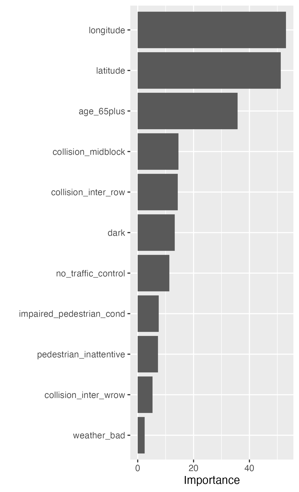

<!-- README.md is generated from README.Rmd. Please edit that file -->

# Predicting the Severity of Pedestrian Collisions in the City of Toronto

## Description

The project investigates the drivers that explain the probability that a
pedestrian collision will result in major injury or fatality in the City
of Toronto. Understanding theses factors could help policy makers design
the appropriate road safety campaigns, road safety infrastructure and
similar activities that could contribute to the success of the City of
Toronto’s Vision Zero Road Safety Plan.

## Methods

Random Forest algorithm was implemented through the “Ranger package” in
R to solve this classification problem. The Random Forest model
parameters mtry (…) and min_n were hyper-tuned using the grid search
method in Ranger. The processed data had 1677 rows and 12 variables
(excluding the binary outcome variable). The data was imbalanced since
the class pedestrian collision resulting in mojor injury or fatality
accounted for 11% of the rows in the outcome variable
(serious_fatality). The imbalanced problem was solved with the SMOTE
algorithm in the “DMwR” R package. This increased the representation of
the minoriy class to 24%.

## Results

Figure 1. below shows the factors that are key to explaining the
likelihood of a pedestrian collision resulting in a serious injury or
death.

<div class="figure">


<p class="caption">
Variable Importance Plot
</p>

</div>

The

Wehort description explaining the what, why, and how. What was your
motivation? Why did you build this project? (Note: The answer is not
“Because it was a homework assignment.”) What problem does it solve?
What did you learn? What makes your project stand out?

## Installation

The project has been designed to ensure reproducibilty through the Renv
package in R. You can replicate the results through the following two
options:

A. In the root folder of this repository, you can run the run.R script
to automatically implement the data wrangling, SMOTE analysis, and model
estimation. You can also modify the custom functions in functions.R
script (R/functions.R) to change the results of the study.  
B1. if you are using Mac you can run the run.R script:  
i). in the command line type cd working directory,  
ii). run the command “Rscript run.R”. If you do not have pandoc please
install with “brew install pandoc”  
B2. if you have Windows install pandoc through the command “winget
install pandoc” and run the run.R script.

In the renv.lock file in the root folder, you will find important
information on all the packages I used for this project.

## Future Work

## Credits

## License

This project was conducted for the Ministry of Transportation as part of
a job interviewing process. Access is retricted only to that institution
and the affiliations they will authorize to modify the project.

What is special about using `README.Rmd` instead of just `README.md`?
You can include R chunks like so:

``` r
summary(cars)
#>      speed           dist       
#>  Min.   : 4.0   Min.   :  2.00  
#>  1st Qu.:12.0   1st Qu.: 26.00  
#>  Median :15.0   Median : 36.00  
#>  Mean   :15.4   Mean   : 42.98  
#>  3rd Qu.:19.0   3rd Qu.: 56.00  
#>  Max.   :25.0   Max.   :120.00
```

You’ll still need to render `README.Rmd` regularly, to keep `README.md`
up-to-date. `devtools::build_readme()` is handy for this. You could also
use GitHub Actions to re-render `README.Rmd` every time you push. An
example workflow can be found here:
<https://github.com/r-lib/actions/tree/v1/examples>.

You can also embed plots, for example:

<!-- -->

In that case, don’t forget to commit and push the resulting figure
files, so they display on GitHub.
